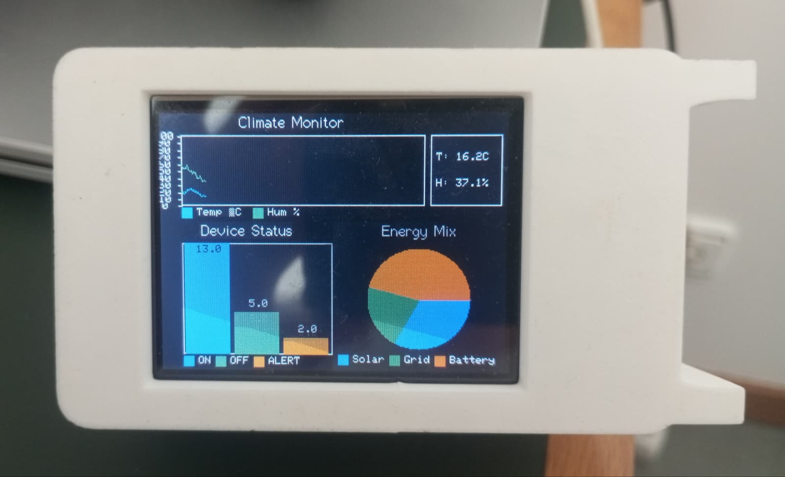

# GraphTFT

**GraphTFT** is an **Arduino/ESP32/ESP8266 library** for drawing **real-time charts** on TFT displays using [TFT\_eSPI](https://github.com/Bodmer/TFT_eSPI).



## ✨ Features

* 📈 **Scrolling line graph** for real-time data
* 🟦 **Bar chart** with numeric values
* 🥧 **Pie chart** with legend
* 📊 Multiple data series with customizable colors and labels
* 📍 Flexible legend placement: top, bottom, left, or right
* 📐 Automatic axis scaling and labeling
* ⚡ Easy integration with sensors and real-time data

---

## 📋 Requirements

* [TFT\_eSPI](https://github.com/Bodmer/TFT_eSPI)
* Supported hardware: Arduino, ESP32, ESP8266

---

## 🚀 Installation

1. Clone or download this repository.
2. In **Arduino IDE**, add the library via:
   **Sketch > Include Library > Add .ZIP Library...**
3. Install [TFT\_eSPI](https://github.com/Bodmer/TFT_eSPI) using the **Arduino Library Manager**.

---

## 📚 Constructors

### 🔹 Line Graph

```cpp
Graph(
    TFT_eSPI *display,
    int x0, int y0,
    int totalW, int totalH,
    int graphYmin, int graphYmax,
    String graphTitle,
    LegendPosition legend = LEGEND_RIGHT,
    int nSeries = 1,
    String names[] = nullptr,
    uint16_t colors[] = nullptr,
    uint16_t bg = TFT_BLACK
)
```

### 🔹 Pie Chart

```cpp
PieChart(
    TFT_eSPI *display,
    int x0, int y0,
    int totalW, int totalH,
    String graphTitle,
    LegendPosition legend = LEGEND_RIGHT,
    int nSeries = 1,
    String names[] = nullptr,
    uint16_t colors[] = nullptr,
    uint16_t bg = TFT_BLACK
)
```

### 🔹 Bar Chart

```cpp
BarChart(
    TFT_eSPI *display,
    int x0, int y0,
    int totalW, int totalH,
    String graphTitle,
    LegendPosition legend = LEGEND_RIGHT,
    int nSeries = 1,
    String names[] = nullptr,
    uint16_t colors[] = nullptr,
    uint16_t bg = TFT_BLACK
)
```

---

## 🛠 Examples

### 📈 Line Graph (Random Data)

```cpp
#include <TFT_eSPI.h>
#include <GraphTFT.h>

#define TFT_GREY 0x5AEB

TFT_eSPI tft = TFT_eSPI();

String names[3] = {"Sensor A", "Sensor B", "Sensor C"};
uint16_t colors[3] = {TFT_GREEN, TFT_RED, TFT_BLUE};

Graph g(&tft, 20, 20, 280, 200, 0, 100, "Test Graph", LEGEND_BOTTOM, 3, names, colors);

void setup() {
    tft.init();
    tft.setRotation(1);
    tft.fillScreen(TFT_GREY);
    g.resetGraph();
}

void loop() {
    g.plotPoint(0, random(0, 100));
    g.plotPoint(1, random(0, 100));
    g.plotPoint(2, random(0, 100));
    g.nextX();
    delay(100);
}
```

---

### 🌡️ Line Graph with DHT22

```cpp
#include <TFT_eSPI.h>
#include <GraphTFT.h>
#include <DHT.h>

#define TFT_GREY 0x5AEB
#define DHTPIN 5
#define DHTTYPE DHT22

TFT_eSPI tft = TFT_eSPI();
DHT dht(DHTPIN, DHTTYPE);

String names[2] = {"Temperature", "Humidity"};
uint16_t colors[2] = {TFT_YELLOW, TFT_BLUE};

Graph g(&tft, 20, 20, 280, 200, 0, 100, "DHT22 Graph", LEGEND_BOTTOM, 2, names, colors);

void setup() {
    Serial.begin(115200);
    tft.init();
    tft.setRotation(1);
    tft.fillScreen(TFT_GREY);
    g.resetGraph();
    dht.begin();
}

void loop() {
    float temp = dht.readTemperature();
    float hum = dht.readHumidity();

    if (!isnan(temp) && !isnan(hum)) {
        g.plotPoint(0, temp);
        g.plotPoint(1, hum);
        g.nextX();
    }
    delay(30000);
}
```

---

### 🥧 Pie Chart

```cpp
#include <TFT_eSPI.h>
#include <GraphTFT.h>

TFT_eSPI tft = TFT_eSPI();

String labels[3] = {"A", "B", "C"};
uint16_t colors[3] = {TFT_RED, TFT_GREEN, TFT_BLUE};

PieChart pie(&tft, 20, 20, 280, 200, "Pie Example", LEGEND_RIGHT, 3, labels, colors);

void setup() {
    tft.init();
    tft.setRotation(1);
    tft.fillScreen(TFT_BLACK);

    float values[3] = {40, 30, 30};
    pie.setData(values);
    pie.draw();
}

void loop() {}
```

---

### 🟦 Bar Chart

```cpp
#include <TFT_eSPI.h>
#include <GraphTFT.h>

TFT_eSPI tft = TFT_eSPI();

String labels[3] = {"X", "Y", "Z"};
uint16_t colors[3] = {TFT_CYAN, TFT_MAGENTA, TFT_ORANGE};

BarChart bar(&tft, 20, 20, 280, 200, "Bar Example", LEGEND_BOTTOM, 3, labels, colors);

void setup() {
    tft.init();
    tft.setRotation(1);
    tft.fillScreen(TFT_BLACK);

    float values[3] = {10.5, 25.2, 15.7};
    bar.setData(values);
    bar.draw();
}

void loop() {}
```

---

## 📑 Public Functions

### 📈 `Graph` (Scrolling Line Graph)

| Function                                                        | Description                                 |
| --------------------------------------------------------------- | ------------------------------------------- |
| `plotPoint(int series, int value)`                              | Plots a point in the selected series        |
| `nextX()`                                                       | Advances the X axis (auto-scroll when full) |
| `resetGraph()`                                                  | Clears and resets the graph                 |
| *(internal)* `drawBox(), drawAxes(), drawTitle(), drawLegend()` | Draw helper functions                       |

---

### 🥧 `PieChart`

| Function                                 | Description                |
| ---------------------------------------- | -------------------------- |
| `setData(float values[])`                | Sets values for each slice |
| `draw()`                                 | Draws the pie chart        |
| *(internal)* `drawTitle(), drawLegend()` | Draw helper functions      |

---

### 🟦 `BarChart`

| Function                                 | Description                             |
| ---------------------------------------- | --------------------------------------- |
| `setData(float values[])`                | Sets values for each bar                |
| `draw()`                                 | Draws the bar chart with numeric values |
| *(internal)* `drawTitle(), drawLegend()` | Draw helper functions                   |

---

## 📄 License

This project is licensed under the **MIT License**.

## 👨‍💻 Author

Made with ❤️ by **Pedro Lucas**