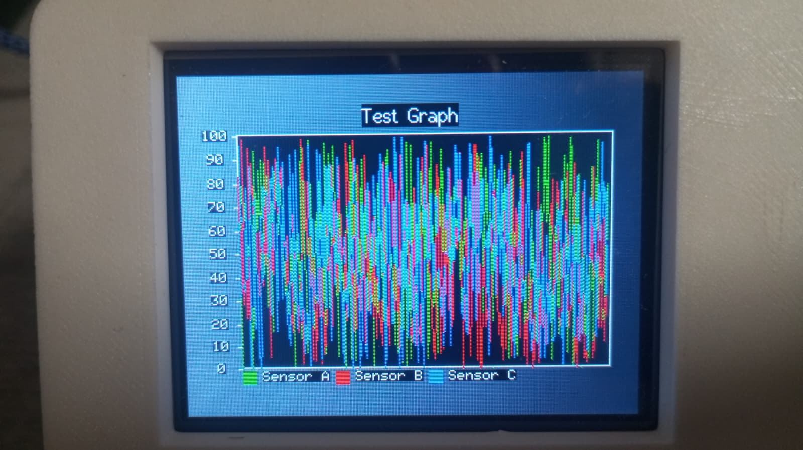

# GraphTFT

**GraphTFT** is an Arduino/ESP32/ESP8266 library for drawing real-time graphs on TFT displays using [TFT_eSPI](https://github.com/Bodmer/TFT_eSPI).



## Features

- Plot multiple data series with customizable colors and labels
- Flexible legend placement: top, bottom, left, or right
- Automatic axis scaling and labeling
- Simple integration with sensor and real-time data

## Requirements

- [TFT_eSPI](https://github.com/Bodmer/TFT_eSPI) library
- Supported hardware: Arduino, ESP32, or ESP8266

## Installation

1. Clone or download this repository.
2. In the Arduino IDE, add the library via **Sketch > Include Library > Add .ZIP Library...**
3. Install [TFT_eSPI](https://github.com/Bodmer/TFT_eSPI) using the Arduino Library Manager.

## Graph Constructor

```cpp
Graph(
    TFT_eSPI *display,
    int x0,
    int y0,
    int totalW,
    int totalH,
    int graphYmin,
    int graphYmax,
    String graphTitle,
    LegendPosition legend = LEGEND_RIGHT,
    int nSeries = 1,
    String names[] = nullptr,
    uint16_t colors[] = nullptr,
    uint16_t bg = TFT_BLACK
)
```

## Usage

### Basic Example

```cpp
#include <TFT_eSPI.h>
#include <GraphTFT.h>

#define TFT_GREY 0x5AEB

TFT_eSPI tft = TFT_eSPI();

String names[3] = {"Sensor A", "Sensor B", "Sensor C"};
uint16_t colors[3] = {TFT_GREEN, TFT_RED, TFT_BLUE};

Graph g(&tft, 20, 20, 280, 200, 0, 100, "Test Graph", LEGEND_BOTTOM, 3, names, colors);

void setup() {
    tft.init();
    tft.setRotation(1);
    tft.fillScreen(TFT_GREY);
    g.resetGraph();
}

void loop() {
    g.plotPoint(0, random(0, 100));
    g.plotPoint(1, random(0, 100));
    g.plotPoint(2, random(0, 100));
    g.nextX();
    delay(100);
}
```

### DHT22 Sensor Example

```cpp
#include <TFT_eSPI.h>
#include <GraphTFT.h>
#include <DHT.h>

#define TFT_GREY 0x5AEB
#define DHTPIN 5
#define DHTTYPE DHT22

TFT_eSPI tft = TFT_eSPI();
DHT dht(DHTPIN, DHTTYPE);

String names[2] = {"Temperature", "Humidity"};
uint16_t colors[2] = {TFT_YELLOW, TFT_BLUE};

Graph g(&tft, 20, 20, 280, 200, 0, 100, "DHT22 Graph", LEGEND_BOTTOM, 2, names, colors);

void setup() {
    Serial.begin(115200);
    tft.init();
    tft.setRotation(1);
    tft.fillScreen(TFT_GREY);
    g.resetGraph();
    dht.begin();
}

void loop() {
    float temp = dht.readTemperature();
    float hum = dht.readHumidity();

    if (!isnan(temp) && !isnan(hum)) {
        g.plotPoint(0, temp);
        g.plotPoint(1, hum);
        g.nextX();
    }
    delay(30000);
}
```

## License

This project is licensed under the MIT License.

## Author

Made with ❤️ by Pedro Lucas